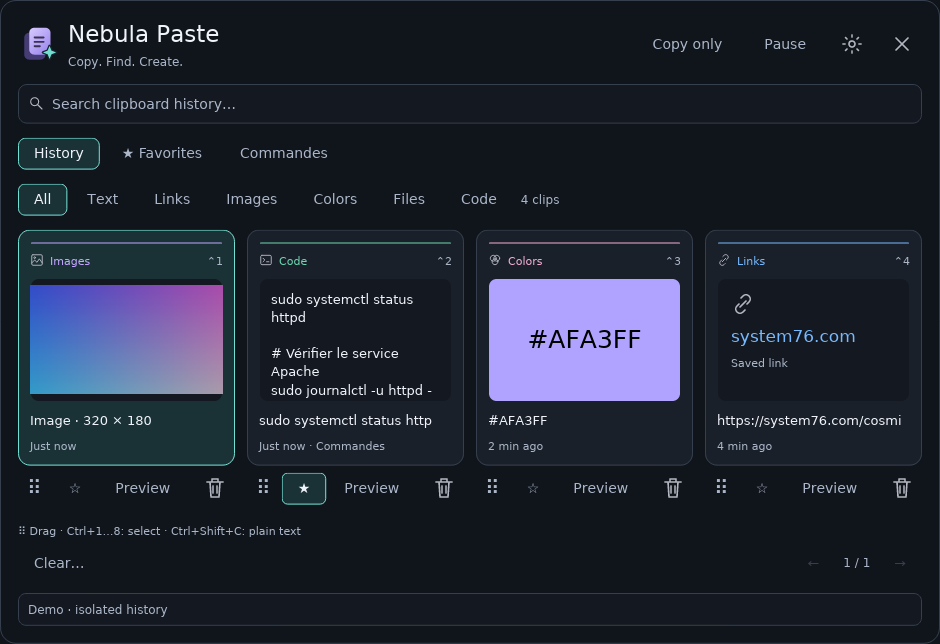

# Nebula Paste

[Français](README.md) · [Changelog](CHANGELOG.md) · [Validation](VALIDATION.md)

A native **Rust/libcosmic clipboard applet for COSMIC on Linux**. Nebula Paste keeps text, images, links, colors, code and file references in a local history. An independent project inspired by Supaste; not affiliated with Supaste or System76.



## Version 0.5 — development preview

- Original full-color application icon and symbolic panel icon; slate surfaces and cyan selection.
- Responsive grid and compact list, with previews, favorites, categories and outgoing drag-and-drop.
- Persistent display, interface language, OCR language, retention and paste preferences.
- English or French interface. The default follows the system locale; use Preferences → Language to override it. OCR language is independent.
- Plain-text copying from Preview or **Ctrl+Shift+C**. Text and source code are preserved exactly; local file URIs become decoded paths. Images require OCR.
- Undo the latest deletion for **12 seconds**, preserving its date, favorite and category. Undo does not overwrite a recaptured clip or evict another clip when history is full.
- Temporary pauses of **5, 15 or 60 minutes**, a countdown and automatic resume. Indefinite pause is also available.
- Visible copy confirmation and an option to keep the popup open after copying. Direct paste always closes it before sending the shortcut.

This branch is a development preview. See [VALIDATION.en.md](VALIDATION.en.md) for completed checks and remaining live COSMIC testing. The screenshot above was rendered from the actual application widgets.

## Build and install on Fedora COSMIC

Install a recent stable Rust toolchain (Rust 1.93 or newer) and the native dependencies:

```bash
sudo dnf install git gcc gcc-c++ make cmake pkgconf-pkg-config libxkbcommon-devel wayland-devel
git clone https://github.com/nabz54/nebula-paste.git
cd nebula-paste
git switch v0.5-design
bash scripts/install.sh
```

Then add Nebula Paste from COSMIC Settings → Desktop → Panel → Applets. Remove and re-add an already running applet after an update. Existing history is preserved.

Tesseract 5.5.1, Leptonica 1.85.0 and the French/English OCR models are bundled. No system Tesseract executable or model download is needed at runtime. Leptonica's two source archive parts are automatically reassembled during the build. Native libraries still require C/C++ build tools. Optional direct paste uses `wtype` (`sudo dnf install wtype`).

## Use

Set a COSMIC shortcut such as **Super+V** to `~/.local/bin/nebula-paste --toggle`. The applet must already be running.

| Shortcut | Action |
| --- | --- |
| Ctrl+1…9 | Copy the corresponding item, if present on the current page |
| Alt+Left / Right | Move selection |
| Alt+Up / Down | Move by row |
| Ctrl+F | Search |
| Ctrl+Shift+C | Copy the previewed or selected item as plain text |
| Enter | Copy selection |
| Escape | Go back or close |

Click the settings icon for language, grid/list, retention and paste preferences. Choose a retention duration, then explicitly apply it; old unpinned clips are deleted only when the new duration is applied. Favorites are protected. “Clear history” is not undoable and clears pending undo.

Settings are saved atomically to `$XDG_CONFIG_HOME/nebula-paste/settings.conf` (normally `~/.config/nebula-paste/settings.conf`). History is stored in `$XDG_DATA_HOME/nebula-paste/history.sqlite3` (normally `~/.local/share/nebula-paste/history.sqlite3`). It is **not encrypted**. Capture pauses do not remove existing clips and do not survive process restarts. File entries are references, not file backups.

Direct paste depends on COSMIC's virtual-keyboard support and the target application's shortcuts. A successful shortcut send does not prove that the target pasted it. Diagnostics from external programs may remain in their original language.

## Preview, OCR and tests

```bash
cargo build --locked
cargo run --locked -- --preview
cargo test --locked
cargo fmt --check
bash scripts/check-embedded-ocr.sh target/debug/nebula-paste
nebula-paste --ocr image.png fra+eng
```

Preview mode uses synthetic in-memory data and disables clipboard capture, copying and external drag-and-drop. `--render-preview output.png` renders the actual widget tree without a display server.

Contribution guidelines: [CONTRIBUTING.en.md](CONTRIBUTING.en.md). Source license: **MPL-2.0**. Bundled components retain the licenses in `vendor/licenses/`. Uninstall with `bash scripts/uninstall.sh`; history and preferences are preserved.
