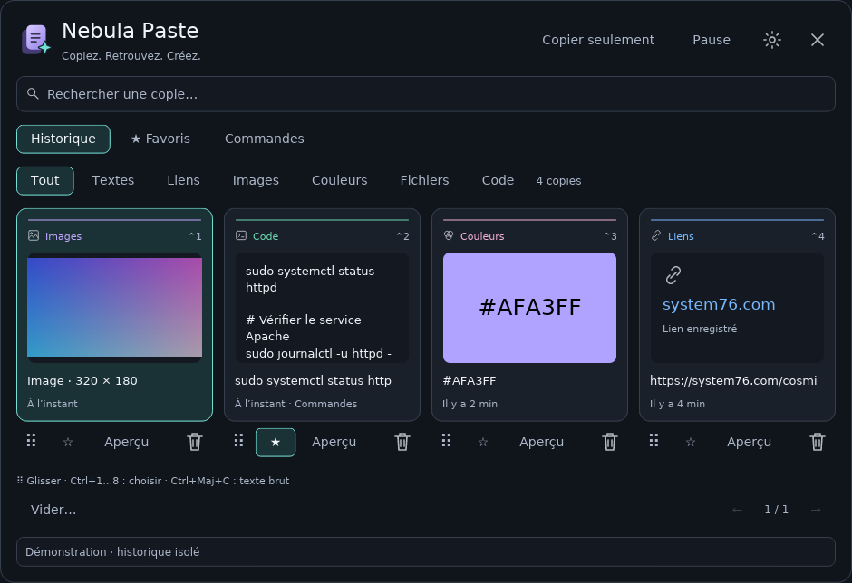

# Nebula Paste — applet pour COSMIC

## 0.6.0-beta.1 — Intégration COSMIC

Thème système, popup compact et fenêtre d’historique séparée partageant les mêmes données. [Installation et guide de test](docs/TESTING-0.6.md). Branche **v0.6-cosmic**. Validation sur le bureau réel à effectuer.

Les captures et notes 0.5 ci-dessous décrivent la version précédente.


[English](README.en.md) · [Changelog français](CHANGELOG.fr.md) · [English changelog](CHANGELOG.md)

Un gestionnaire de presse-papiers natif, écrit en Rust avec **libcosmic**, inspiré de l’organisation visuelle de [Supaste](https://www.supaste.com/). Version de développement **0.5.0-dev.1**. Projet indépendant, sans affiliation à Supaste ou System76.



La 0.5 est en préparation : [identité, changements intégrés et améliorations proposées](docs/DESIGN-0.5.md). La capture ci-dessus provient du rendu natif des widgets. La planche d’identité est disponible dans le guide de conception.

Pour contribuer, consulte [CONTRIBUTING.md](CONTRIBUTING.md). Les contrôles effectués et les limites de validation sont détaillés dans [VALIDATION.md](VALIDATION.md).

## Version 0.4.0 : OCR embarqué

Tesseract 5.5.1 et Leptonica 1.85.0 sont compilés et liés statiquement à Nebula Paste. Les modèles français et anglais de tessdata_fast 4.1.0 sont incorporés dans l’exécutable. Aucun programme tesseract, paquet de langues ou téléchargement de modèle n’est nécessaire à l’utilisation.

L’interface reste en Rust/libcosmic ; le moteur OCR embarqué est en C/C++, appelé par son API C. Les sources natives, modèles, licences et empreintes SHA-256 sont inclus dans vendor/. Le code PNG/JPEG existant en Rust décode les images avant de transmettre les pixels au moteur.

### Mise à jour sur Fedora

La compilation depuis les sources nécessite les outils suivants, en plus des dépendances COSMIC déjà installées :

```bash
sudo dnf install cmake make gcc gcc-c++
bash scripts/install.sh
```

La première compilation est plus longue car elle construit aussi le moteur OCR. L’exécutable installé contient le moteur et les langues ; les outils de compilation ne sont pas nécessaires à son fonctionnement. Le collage direct conserve sa dépendance facultative à wtype (`sudo dnf install wtype`).

**OCR :** ouvre l’aperçu d’une image, sélectionne Français + anglais, Français ou Anglais, puis « Extraire le texte · OCR ». Le traitement s’exécute en arrière-plan. Le texte est ajouté à l’historique puis ouvert pour vérification, sans copie automatique. Le moniteur interne Tesseract demande l’arrêt après 30 secondes de reconnaissance ; cette limite est coopérative et ne constitue pas un arrêt forcé du processus.

L’image et le texte restent en mémoire pendant la reconnaissance. Les modèles publics inclus dans l’exécutable sont temporairement placés dans un dossier privé, puis supprimés à la fin de l’opération. Aucun accès aux modèles système n’est nécessaire. Supprimer l’image pendant le traitement empêche la réinsertion du résultat. Les images transparentes sont compositées sur fond blanc pour préserver le texte sombre.

Le design 0.3 est conservé : palette bleu nuit, accents par type, grille défilante, recherche Ctrl+F, favoris, catégories, aperçu et glisser-déposer sortant.

**Collage direct :** le bouton « Copier seulement » en haut fait défiler les trois modes. Place d’abord le curseur dans l’application cible, ouvre Nebula Paste avec ton raccourci puis choisis une carte. En mode collage, le volet se ferme, attend 350 ms pour le retour du focus, puis envoie Ctrl+V ou Ctrl+Maj+V. La cible est l’application active à cet instant, pas une application identifiée par l’applet. Le protocole clavier virtuel doit être autorisé par COSMIC. En cas d’échec de wtype, le volet affiche l’erreur et le contenu reste copié. La réussite de wtype confirme l’envoi du raccourci, pas son traitement par l’application. Le mode choisi est conservé au redémarrage ; « Copier seulement » est le réglage initial.

**Glisser-déposer :** maintiens la poignée à points à gauche sous une carte et déplace-la vers une application acceptant son format. Le clic sur la carte conserve son rôle de copie. Pour les images, la cible doit accepter directement PNG/JPEG ; l’applet ne crée pas un fichier image exporté pour les zones qui n’acceptent que des fichiers. Les fichiers conservés dans l’historique restent des références vers leur emplacement d’origine. Pas de dépôt entrant dans cette version. Le mode de démonstration désactive les transferts vers les autres applications.

Pour mettre à jour : retire temporairement Nebula Paste du panneau, extrais cette archive dans le même dossier que la précédente, puis lance `bash scripts/install.sh` et rajoute l’applet. La base SQLite et son emplacement ne changent pas ; ton historique est conservé.

### Aperçu sans toucher à l’historique

Après compilation, `target/release/nebula-paste --preview` ouvre une fenêtre avec des données fictives en mémoire. La capture et la recopie sont désactivées dans ce mode. `--render-preview fichier.png` produit une capture du même arbre de widgets via le moteur logiciel, sans serveur graphique. Une capture de cette livraison est incluse dans `docs/preview-0.5-fr.png`.

## Utilisation

1. Copie un texte, un lien, une couleur `#abc`/`#aabbcc`, une image PNG/JPEG ou des fichiers depuis une application.
2. Clique sur l’icône du presse-papiers dans le panneau COSMIC.
3. Recherche, filtre par type, ou ouvre les favoris et catégories.
4. Clique sur une carte : son contenu retourne au presse-papiers et le volet se ferme.
5. En mode « Copier seulement », colle avec **Ctrl+V** dans l’application souhaitée ; les modes de collage direct envoient le raccourci après fermeture.

### Préférences, texte brut et pause (0.5)

**Langue de l’interface :** automatique selon la langue du système, ou français/anglais via Préférences → Langue. Ce choix est indépendant de la langue OCR. L’option « Après copie » permet de rester ouvert en copie seule ; le collage direct ferme toujours le volet.

L’icône d’engrenage ouvre les préférences : **affichage** (grille ou liste compacte), **langue de l’OCR**, **durée de rétention** et **mode de collage**. Elles sont conservées dans `~/.config/nebula-paste/settings.conf` et relues au démarrage. Une valeur inconnue dans ce fichier est ignorée au profit de la valeur par défaut. Après avoir choisi la durée, clique sur **Appliquer la rétention**. Faire défiler les durées ne supprime rien. La rétention supprime les entrées plus anciennes que la durée choisie et ne touche jamais les favoris.

En liste compacte, le volet se réduit à une colonne pour les petits écrans et les fortes mises à l’échelle ; aucun contrôle ne disparaît, les intitulés deviennent des icônes. En grille, le nombre de colonnes suit la largeur réellement accordée au volet.

**Texte brut :** dans l’aperçu, « Copier en texte brut » ou Ctrl+Maj+C rend le même texte sans mise en forme, les URI de fichiers locaux devenant des chemins. Le texte et le code déjà en texte brut sont conservés exactement, y compris leurs espaces et leurs balises éventuelles. L’entrée conservée dans l’historique n’est pas modifiée.

**Suppression annulable :** après une suppression, la barre d’état propose « Annuler la suppression » pendant douze secondes, avec compte à rebours. L’entrée revient avec sa date, son favori et sa catégorie. Une recapture identique reste inchangée. Si l’historique est plein, l’annulation échoue sans évincer une autre copie. Vider l’historique supprime aussi l’annulation en attente.

**Pause temporaire :** le bouton **Pause** propose 5, 15 ou 60 minutes, ou une pause sans limite. Le temps restant est affiché et la capture reprend seule à l’échéance. Les copies faites pendant la pause ne sont pas importées après la reprise.

Le bouton **Aperçu** affiche le contenu et permet d’attribuer une catégorie libre, par exemple « Travail », « Commandes » ou « Modèles ». L’étoile conserve un élément dans les favoris. **Vider** demande confirmation et conserve les favoris.

## Installation

Il faut une session **COSMIC sous Wayland**, un compilateur C, Git et **Rust stable récent** (minimum annoncé par libcosmic : 1.93). Les dépendances exactes sont consignées dans `Cargo.lock` ; la révision de libcosmic est fixée dans `Cargo.toml`.

Si Rust est déjà installé avec rustup :

```bash
rustup update stable
```

Sinon, installe Rust suivant [les instructions officielles](https://rustup.rs), puis ouvre un nouveau terminal.

Sous **Fedora avec COSMIC**, installe les bibliothèques de compilation :

```bash
sudo dnf install gcc gcc-c++ cmake make git pkgconf-pkg-config libxkbcommon-devel wayland-devel fontconfig-devel
```

Sous **Pop!_OS / Ubuntu / Debian avec COSMIC** :

```bash
sudo apt install build-essential cmake git pkg-config libxkbcommon-dev libwayland-dev libfontconfig1-dev
```

Depuis le dossier extrait :

```bash
cd nebula-paste
bash scripts/install.sh
```

Le script compile avec `cargo build --release --locked` puis installe l’exécutable et son entrée d’applet pour ton utilisateur. Il ne nécessite pas `sudo`. La première compilation télécharge les dépendances et peut prendre plusieurs minutes.

Dans **Paramètres COSMIC → Bureau → Panneau → Applets**, ajoute **Nebula Paste**. Les intitulés peuvent varier selon la version de COSMIC. Si l’applet n’apparaît pas immédiatement, déconnecte puis reconnecte la session.

### Ouverture avec Super+V

Dans les raccourcis personnalisés de COSMIC, associe **Super+V** à la commande affichée par l’installateur, par exemple :

```text
/home/ton-utilisateur/.local/bin/nebula-paste --toggle
```

L’applet doit déjà être présent dans le panneau. Ce raccourci contacte l’instance active ; il ne lance pas un deuxième gestionnaire. Si Super+V est déjà utilisé, choisis une autre combinaison.

### Clavier dans le volet

| Touche | Action |
| --- | --- |
| Ctrl+1 à Ctrl+9 | Copier la carte correspondante de la page affichée |
| Alt+← / Alt+→ | Changer la carte sélectionnée |
| Alt+↑ / Alt+↓ | Changer de ligne ; en liste compacte, d’un élément |
| Ctrl+Maj+C | Copier la sélection ou l’aperçu ouvert en texte brut |
| Entrée depuis la recherche | Copier la sélection |
| Ctrl+F | Revenir à la recherche |
| Échap | Fermer les préférences ou la pause, annuler la confirmation, revenir de l’aperçu ou fermer |

Le nombre de raccourcis Ctrl+chiffre suit la taille de page : elle dépend de la largeur du volet et de la densité choisie. La ligne d’aide en bas du volet affiche la valeur courante.

## Fonctionnalités implémentées

- Véritable icône de panneau et popup COSMIC, avec les composants natifs et une palette sombre dédiée au volet.
- Cartes avec aperçu, navigation par pages, recherche multi-mots.
- Historique local persistant dans SQLite ; dédoublonnage par contenu et MIME.
- Favoris persistants et catégories libres.
- Textes UTF-8 préservés exactement, liens, détection heuristique du code, couleurs hexadécimales.
- Images PNG et JPEG : miniature et recopie des octets d’origine.
- Fichiers : conservation de la liste d’URI, sans dupliquer les fichiers eux-mêmes.
- Surveillance événementielle Wayland : `ext-data-control`, avec repli sur `wlr-data-control`.
- Recopie native via `wl-clipboard-rs`, sans dépendance à `wl-copy`, `wl-paste` ou un service de simulation clavier.
- Pause de capture pour la session et reprise ; invalidation des transferts en cours lors d’une pause ou d’une suppression.
- Pause temporaire de 5, 15 ou 60 minutes avec compte à rebours et reprise automatique.
- Préférences persistantes : densité d’affichage, langue OCR, durée de rétention, mode de collage.
- Largeur adaptative, mode liste compact et navigation clavier commune aux deux mises en page.
- Copie en texte brut et annulation d’une suppression pendant douze secondes.
- Maximum de 500 éléments et de 128 Mio de contenus ; éviction des plus anciens hors favoris.
- Limite de 16 Mio par copie, durée de transfert bornée, contrôle des dimensions et de la mémoire lors du décodage des images.
- Instance unique et commande locale `--toggle`.

## Données et confidentialité

Les données sont dans `${XDG_DATA_HOME:-~/.local/share}/nebula-paste/history.sqlite3`. Le dossier est en permissions `700`, la base en `600`. L’application ne contient aucune fonction d’envoi réseau ; les téléchargements concernent seulement la compilation des dépendances.

La base **n’est pas chiffrée**. Les offres portant des marqueurs explicites de secret connus sont ignorées, mais toutes les applications n’en émettent pas. La pause est disponible pour les copies confidentielles. Elle n’efface pas les copies existantes et n’est pas conservée après fermeture de l’applet.

La limite de 128 Mio porte sur les contenus actifs ; le fichier SQLite peut conserver de l’espace libre après une suppression. `secure_delete` efface les données supprimées dans les pages SQLite, sans garantir leur disparition des sauvegardes ou du stockage physique.

## Périmètre de cette version

Cette version reprend les principes de Supaste (cartes, aperçu, filtres, favoris et catégories), **pas une reproduction pixel pour pixel de son interface macOS ni la totalité de ses fonctions**.

- Le collage direct dépend du protocole clavier virtuel, du retour du focus et des raccourcis acceptés par l’application cible. La copie seule reste le mode par défaut.
- Pas de capture d’écran intégrée, de synchronisation, d’expansion de texte ni d’import par glisser-déposer.
- Pas de regroupement fiable par application source : le protocole data-control n’indique pas cette information.
- Un seul format est retenu par offre, par priorité : fichiers, PNG, JPEG, puis texte. La mise en forme HTML et les autres représentations simultanées ne sont pas archivées.
- Les références de fichiers ne fonctionnent plus si les fichiers ont été déplacés ou supprimés. Les opérations de coupe de fichiers sont restaurées comme copies de références.
- Premier siège Wayland disponible ; les configurations multi-sièges ne sont pas prises en charge.
- Installation native prévue ; Flatpak peut empêcher l’accès au protocole data-control.
- Le popup vise un écran de bureau et utilise une largeur de 940 pixels logiques. L’adaptation aux écrans très étroits reste à réaliser.

## Développement et vérification

```bash
cargo fmt --check
cargo check --locked
cargo test --locked
cargo clippy --locked --all-targets -- -D warnings
```

Les tests vérifient la persistance, le dédoublonnage, les favoris, l’éviction, le rollback lorsque tous les emplacements sont épinglés, les permissions, la recherche, les marqueurs de secrets et les contenus invalides. Voir `VALIDATION.md` pour les résultats de cette livraison.

### Vérification dans COSMIC

1. Ajouter l’applet au panneau, vérifier son icône et l’ouverture/fermeture du volet.
2. Copier du texte accentué, arabe, une URL, une commande et une couleur ; vérifier leurs cartes et filtres.
3. Copier une image PNG/JPEG puis la recopier depuis une carte dans une application qui accepte les images.
4. Copier des fichiers dans le gestionnaire de fichiers, puis les recopier depuis une carte dans un dossier de test.
5. Épingler une carte, lui donner une catégorie, relancer la session et vérifier sa conservation.
6. Mettre en pause, copier un texte distinct, reprendre ; ce texte ne doit pas être ajouté rétroactivement.
7. Vérifier le raccourci `--toggle`, les raccourcis du volet et l’échec propre d’une seconde instance.
8. Vider l’historique et vérifier que seuls les favoris restent.
9. Extraire le texte d’une capture française avec accents, puis anglaise ; vérifier aussi une image sans texte. Aucun paquet de langues n’est requis.
10. Depuis un éditeur puis un terminal, ouvrir au raccourci et choisir une carte dans le mode de collage approprié ; vérifier aussi la conservation du mode choisi au redémarrage.
11. Glisser texte, image et référence de fichier vers des cibles compatibles ; annuler un glissement avec Échap, puis vérifier que la copie par clic fonctionne encore.

Le code a été compilé et le rendu des widgets contrôlé dans une capture hors écran. **Le positionnement du popup et les échanges Wayland doivent encore être revérifiés dans ta session COSMIC réelle.**

### Architecture

| Fichier | Rôle |
| --- | --- |
| `src/app.rs` | Applet, cartes, recherche et interactions |
| `src/actions.rs` | Actions asynchrones et raccourci de collage |
| `src/ocr.rs` | API C Tesseract, modèles embarqués et reconnaissance |
| `build.rs` | Compilation statique des sources OCR incluses |
| `src/transfer.rs` | Formats natifs du glisser-déposer sortant |
| `src/clipboard.rs` | Événements Wayland, transferts bornés, recopie |
| `src/model.rs` | Contenus, classification, miniatures et limites |
| `src/storage.rs` | SQLite, dédoublonnage, rétention et cache des contenus |
| `src/ipc.rs` | Instance unique et raccourci d’ouverture |
| `resources/` | Déclaration d’applet et icône |
| `tests/history.rs` | Tests du moteur |

## Désinstallation

Retire l’applet du panneau, puis :

```bash
bash scripts/uninstall.sh
```

L’historique est conservé. Pour le supprimer aussi, efface le dossier `nebula-paste` dans ton dossier de données utilisateur.

## Sources techniques et licence

- [Modèle officiel d’applet COSMIC](https://github.com/pop-os/cosmic-applet-template)
- [libcosmic, révision utilisée](https://github.com/pop-os/libcosmic/tree/d4d71fd53e5ed6bd3a430089114dffa2da3cd498)
- [wl-clipboard-rs](https://github.com/YaLTeR/wl-clipboard-rs)
- [Protocoles Wayland](https://gitlab.freedesktop.org/wayland/wayland-protocols)
- [Référence d’expérience utilisateur : Supaste](https://www.supaste.com/)

Sources Nebula Paste sous **MPL-2.0**, voir `LICENSE`. Les dépendances gardent leurs licences respectives.

Moteur OCR embarqué : [API Tesseract](https://tesseract-ocr.github.io/tessdoc/APIExample.html). Collage direct facultatif : [wtype](https://github.com/atx/wtype).

### Diagnostic de l’OCR embarqué

```bash
nebula-paste --ocr image.png fra
nebula-paste --ocr image.png eng
nebula-paste --ocr image.png fra+eng
```

Cette commande utilise le même moteur que le bouton OCR et ne nécessite ni panneau ni session graphique. Elle écrit le texte reconnu sur la sortie standard.

Le contrôle `bash scripts/check-embedded-ocr.sh` vérifie l’OCR après `cargo build` avec un PATH vide et sans modèles système. Un chemin d’exécutable peut être passé en argument, par exemple `bash scripts/check-embedded-ocr.sh target/release/nebula-paste`.

