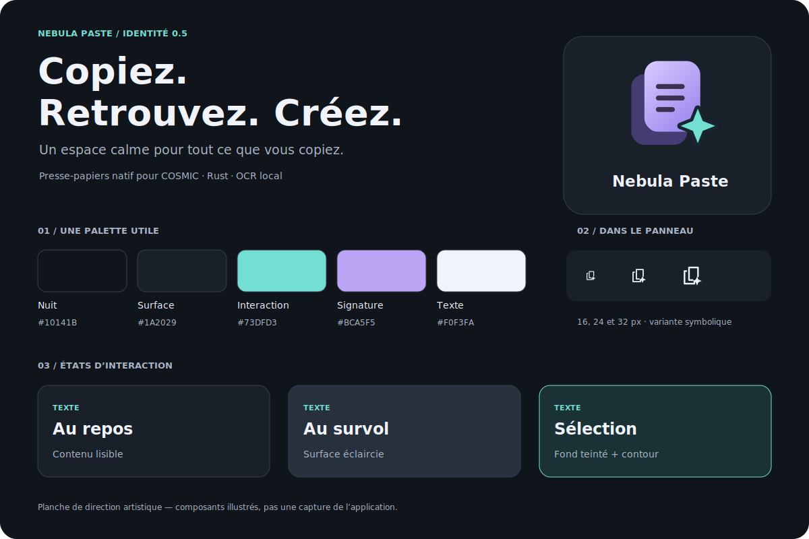

# Nebula Paste 0.5 — identité et feuille de route

Statut : première proposition intégrée, version `0.5.0-dev.1`. Cette branche prépare la 0.5 ; ce n’est pas une version stable.

## Une identité propre

Deux feuilles évoquent la copie et l’historique ; une étoile cyan signe Nebula. La silhouette reste simple, avec un léger volume dans l’icône couleur et une variante symbolique sans dégradé pour le panneau. Le dessin est original, sous la licence MPL-2.0 du projet ; aucun pictogramme System76 n’est repris. Le [thème COSMIC](https://github.com/pop-os/cosmic-icons) sert de contexte d’intégration, sans prétendre à une certification officielle.

La signature « Copiez. Retrouvez. Créez. » décrit le geste utilisateur. Le violet porte la marque ; le cyan indique l’interaction. Les couleurs par type de contenu restent secondaires et sont accompagnées de libellés. Les surfaces sont opaques pour préserver la lisibilité.

| Rôle | Couleur | Usage |
| --- | --- | --- |
| Fond | `#10141B` | Fond général |
| Surface | `#1A2029` | Cartes |
| Interaction | `#73DFD3` | Focus et sélection |
| Signature | `#BCA5F5` | Identité violette |
| Texte | `#F0F3FA` | Information principale |
| Texte secondaire | `#ABB7C9` | Dates et aides |

Le panneau utilise `io.github.nebulapaste.NebulaPaste-symbolic`. Le lanceur et l’en-tête utilisent l’icône couleur. La pause conserve pour le moment le symbole système existant. L’installation et la désinstallation prennent en charge la nouvelle ressource.

## Déjà intégré dans cette branche

- Icône couleur SVG et variante symbolique 24 px.
- Icône de marque dans l’en-tête et symbole spécifique dans le panneau.
- Nouvelle palette : surfaces ardoise, sélection cyan teintée, survol plus clair.
- Signature éditoriale et planche visuelle avec tailles 16, 24 et 32 px.
- Version de développement cohérente dans Cargo.toml et Cargo.lock.

La planche illustre la direction artistique ; elle n’est pas une capture de l’application compilée. Les captures `preview*.png` existantes représentent la version précédente.

## Améliorations proposées, non implémentées

| Priorité | Amélioration | Résultat attendu | Critère de validation |
| --- | --- | --- | --- |
| 0.5 · haute | Largeur adaptative et mode liste compact | Utilisation confortable sur petits écrans et avec mise à l’échelle | Aucun contrôle masqué ; navigation clavier cohérente entre liste et grille |
| 0.5 · haute | Paramètres persistants | Conserver densité, langue OCR, durée de rétention et mode de collage | Préférences conservées au redémarrage, valeurs invalides gérées |
| 0.5 · haute | Copier en texte brut | Retirer la mise en forme en une action | Même texte, format texte brut, raccourci documenté |
| 0.5 · haute | Annuler une suppression et confirmation de copie | Actions plus compréhensibles et erreurs récupérables | Retour d’état visible, annulation sans doublon, favoris préservés |
| 0.5 · haute | Pause temporaire explicite | Suspendre la capture pour 5, 15 ou 60 minutes | Compte à rebours visible, reprise sans importer les copies faites pendant la pause |
| 0.5 · moyenne | Recherche dans le texte OCR enregistré | Retrouver une image avec les mots qu’elle contient | OCR à la demande, résultat lié à l’image source, suppression cohérente |
| 0.5 · moyenne | Gestion des collections | Renommer, fusionner et ordonner les catégories existantes | Aucun clip perdu ; doublons de noms gérés |
| Ensuite | Thème clair et suivi du thème COSMIC | Intégration aux préférences du bureau | Contrastes et focus vérifiés dans les deux thèmes |
| Ensuite | Fragments réutilisables | Modèles de commandes, signatures et réponses fréquentes | Insertion prévisible, édition et suppression accessibles |
| Ensuite | Paquet RPM et intégration continue | Installation Fedora et validation plus simples | Installation, mise à jour et désinstallation testées sur une VM COSMIC |

Ordre recommandé : ergonomie adaptative, paramètres, retour d’action, pause temporaire, puis recherche OCR. La recherche existe déjà ; l’OCR embarqué, les favoris, les catégories et le glisser-déposer sortant existent aussi. Les propositions ci-dessus les complètent.

## Avant une version stable

Compiler sur Fedora COSMIC, vérifier les icônes dans les panneaux clair/sombre et à plusieurs échelles, refaire les captures natives, tester les raccourcis, le collage et la pause en session Wayland. Les contrôles statiques de cette proposition ne remplacent pas ces essais.
